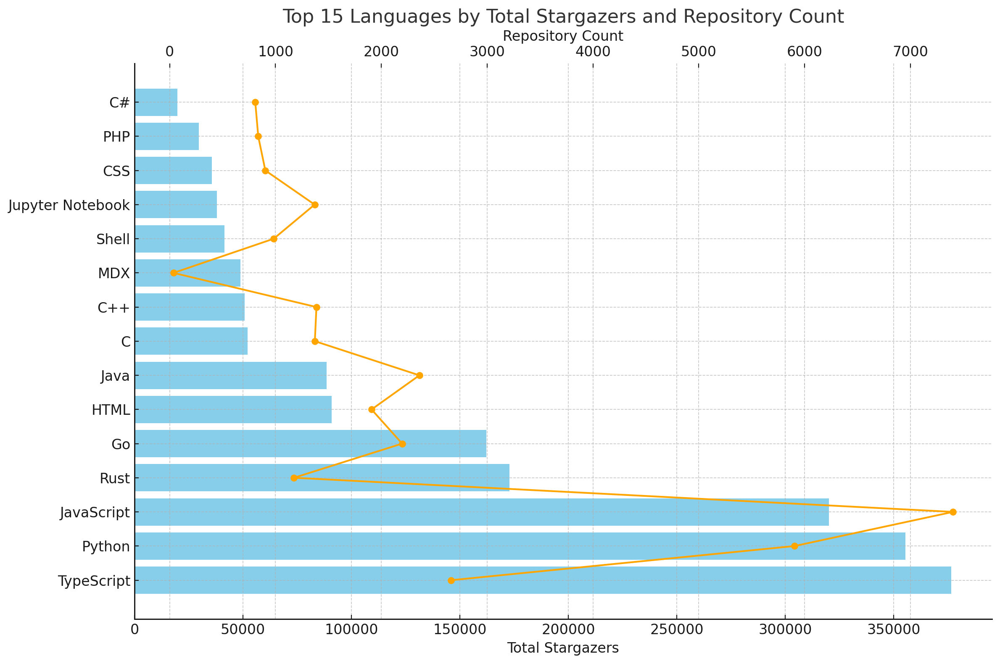

# TDS-PROJECT-1
# GitHub Users in Singapore with Over 100 Followers

### Key Insights

- I used the GitHub API to scrape users located in Singapore with over 100 followers, as well as their 500 most recently pushed repositories and carried out analysis for finding solution and interesting insight.
- The most interesting insight was that **JavaScript** and **Python** were the most commonly used programming languages, however **TypeScript** is having high trend among these users.
- Developers looking to gain visibility should consider creating more public repositories in most common/ trending language to increase their followers.

### Process and Result

1. Generated a personal access token from github.
2. Fetched GitHub users located in Singapore with over 100 followers and their 500 most recently pushed repositories using using **fetch_data.py**.
3. Cleaned the data and saved it into two CSV files: `users.csv` (user details) and `repositories.csv` (repository details).
4. Used Google Colab and tried to find solution of all questions as mentioned in **analysis.ipynb**
5. Created a table of top 10 language of repositories of these users and thereby, created a chart for visualization.

### Files in This Repository

- **fetch_data.py**: Contain python code to extract data while tracking progress of fetched data. 
- **users.csv**: Contains details of GitHub users in Singapore with over 100 followers.
- **repositories.csv**: Contains details of the public repositories of these users.
- **analysis.ipynb**: Contains all questions and their solution with using python libraries panda and statsmodels.
- **trend.csv**: Contains trend table of top 10 languages of repositories of these users.
- **trend.png**: Contains trend chart of top 10 languages of repositories of these users.

